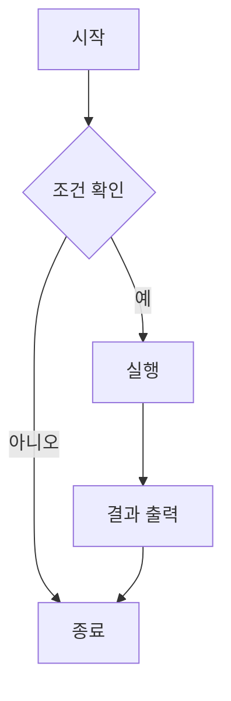
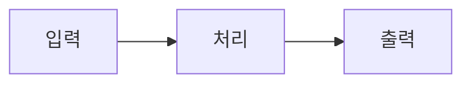

---
# ============================================================================
# Chirpy 테마 Jekyll 블로그 포스트 완전 템플릿
# 이 템플릿을 복사해서 매번 사용하세요!
# ============================================================================

# ============================================================================
# 🔥 필수 설정 (항상 채워야 하는 부분)
# ============================================================================

title: "포스트 제목을 여기에 입력하세요"                    # 브라우저 탭과 포스트 제목
date: 2024-09-08 15:30:00 +0900                        # YYYY-MM-DD HH:MM:SS +0900 (한국시간)

# ============================================================================
# 📂 분류 및 태그 (SEO와 네비게이션에 중요)
# ============================================================================

categories: [대분류, 중분류]                             # 최대 2개 권장, 첫글자 대문자
tags: [tag1, tag2, tag3]                              # 소문자, 하이픈 사용 가능, 3-8개 권장

# ============================================================================
# 👤 작성자 정보 (선택사항 - 기본값은 _config.yml에서 가져옴)
# ============================================================================

# author: Sung-Min Park                                  # 단일 작성자
# authors: [author1, author2]                         # 복수 작성자시 위 줄 주석처리 후 사용

# ============================================================================
# 📄 포스트 메타데이터 (SEO 최적화)
# ============================================================================

description: "포스트에 대한 간단한 설명 (150자 이내, 검색 결과에 표시됨)"

# ============================================================================
# 🖼️ 소셜 미디어 공유 이미지 (선택사항)
# ============================================================================

image:
  path: /assets/img/site/preview.png                  # 1200x630 권장 크기
  alt: "이미지에 대한 설명"                               # 접근성을 위한 대체 텍스트
  lqip: data:image/webp;base64,UklGRpoAAABXRUJQ...      # 저화질 미리보기 (선택사항)

# ============================================================================
# ⚙️ 포스트 기능 설정
# ============================================================================

toc: true                                             # 목차 표시 (true/false)
comments: true                                        # 댓글 허용 (true/false)  
math: true                                           # 수학 공식 MathJax 사용 (true/false)
mermaid: false                                        # 다이어그램 사용 (true/false)
pin: false                                            # 홈페이지 상단 고정 (true/false)

# ============================================================================
# 🔧 고급 설정 (필요시에만 사용)
# ============================================================================

# media_subpath: /assets/img/posts/2024-09-08/         # 이 포스트의 미디어 파일 경로 접두사
# published: false                                    # false시 초안으로 저장
# render_with_liquid: false                           # Liquid 코드 렌더링 비활성화

---

<!-- 
============================================================================
📝 본문 작성 가이드
============================================================================

1. 제목 계층 구조
   # 메인 제목 (포스트당 1개만)
   ## 큰 소제목 
   ### 작은 소제목
   #### 더 작은 소제목

2. 텍스트 서식
   **굵은 글씨**
   *기울임 글씨*
   `인라인 코드`
   ~~취소선~~

3. 링크
   [텍스트](URL)
   [내부 링크](/posts/다른-포스트/)

4. 목록
   - 순서 없는 목록
   - 두 번째 항목
   
   1. 순서 있는 목록
   2. 두 번째 항목

============================================================================
-->

# 포스트 메인 제목

포스트의 개요나 서론을 여기에 작성하세요. 첫 번째 문단은 자동으로 포스트 미리보기로 사용됩니다.

## 소제목 1

### 이미지 삽입 예시

기본 이미지:


크기 지정:
{: w="700" h="400" }

위치 지정:
{: .left w="300" h="200" }
{: .right w="300" h="200" }

그림자 효과 (스크린샷용):
{: .shadow }

다크/라이트 모드별 이미지:
{: .light }
{: .dark }

캡션이 있는 이미지:

_이것은 이미지 캡션입니다_

### 코드 블록 예시

기본 코드 블록:
```python
def hello_world():
    print("Hello, World!")
    return "완료!"
```

파일명 표시:
```python
print("파일명이 표시됩니다")
```
{: file="main.py" }

줄 번호 숨기기:
```bash
echo "줄 번호가 표시되지 않습니다"
```
{: .nolineno }

파일 경로 하이라이트:
`/path/to/file.txt`{: .filepath}

### 수학 공식 예시 (math: true일 때)

블록 수식:

$$
E = mc^2
$$

방정식 번호 매기기:

$$
\begin{equation}
\frac{d}{dx}\int_{a}^{x} f(t) dt = f(x)
\label{eq:ftc}
\end{equation}
$$

방정식 참조: 위의 식 \eqref{eq:ftc}는 미적분학의 기본정리입니다.

인라인 수식: 이것은 $$ x = \frac{-b \pm \sqrt{b^2-4ac}}{2a} $$ 근의 공식입니다.

### 다이어그램 예시 (mermaid: true일 때)



플로우차트:


### 동영상 삽입

YouTube:


로컬 비디오 파일:


고급 설정:


### 오디오 삽입



### 알림창 (Prompts)

> 팁 알림창입니다.
{: .prompt-tip }

> 정보 알림창입니다.
{: .prompt-info }

> 경고 알림창입니다.
{: .prompt-warning }

> 위험 알림창입니다.
{: .prompt-danger }

### 인용문

> 이것은 인용문입니다. 
> 여러 줄로 작성할 수 있습니다.

### 표 (테이블)

| 헤더1   | 헤더2   | 헤더3   |
| ------- | ------- | ------- |
| 데이터1 | 데이터2 | 데이터3 |
| 데이터4 | 데이터5 | 데이터6 |

### 체크리스트

- [x] 완료된 작업
- [ ] 미완료 작업
- [ ] 또 다른 미완료 작업

## 소제목 2

여기에 추가 내용을 작성하세요.

### Liquid 코드 예시 (필요시)


```liquid

  포스트가 있습니다!

```


## 결론

포스트를 마무리하는 내용을 작성하세요.

---

<!-- 포스트 하단 메타 정보 -->
> 📝 **작성 정보**  
> 작성일: {{ page.date | date: "%Y년 %m월 %d일" }}  
> 카테고리: {{ page.categories | join: " > " }}  
> 태그: {{ page.tags | join: ", " }}

*이 포스트가 도움이 되었다면 댓글로 알려주세요! 🚀*

<!-- 
============================================================================
📋 포스트 작성 완료 체크리스트
============================================================================

작성 완료 후 확인할 항목들:

□ 파일명이 YYYY-MM-DD-title.md 형식인가?
□ Front Matter의 모든 필수 항목을 채웠는가?
□ 날짜 형식이 올바른가? (YYYY-MM-DD HH:MM:SS +0900)
□ 카테고리가 [대분류, 중분류] 형식인가?
□ 태그가 소문자로 작성되었는가?
□ 이미지 경로가 올바른가?
□ 로컬에서 미리보기가 정상적으로 표시되는가?
□ 수학 공식이 있다면 math: true로 설정했는가?
□ 다이어그램이 있다면 mermaid: true로 설정했는가?
□ SEO를 위한 description을 작성했는가?

============================================================================
-->
