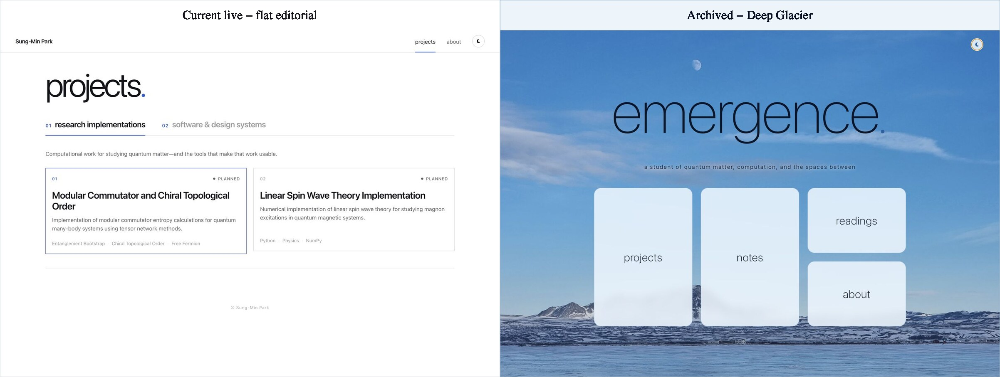
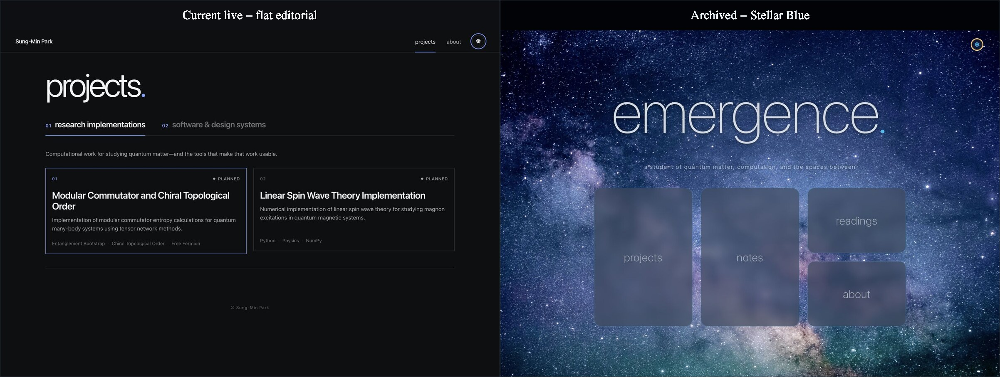
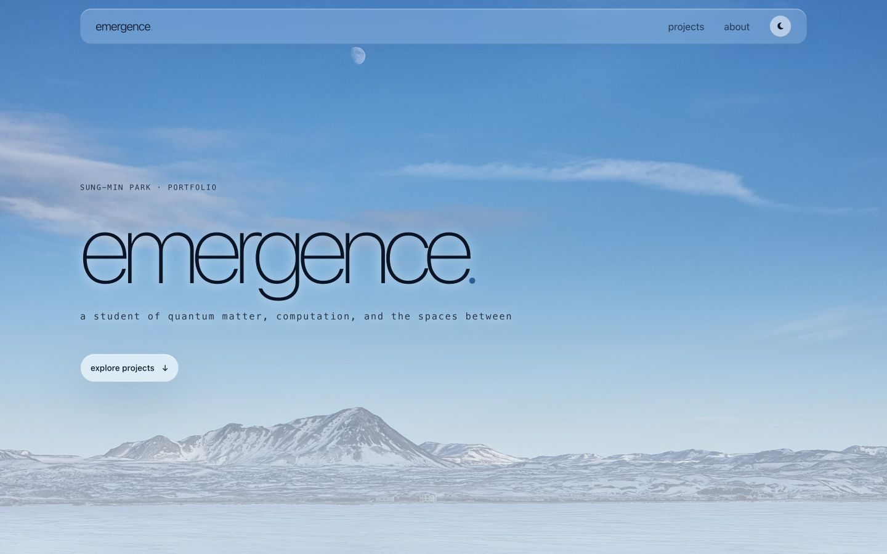
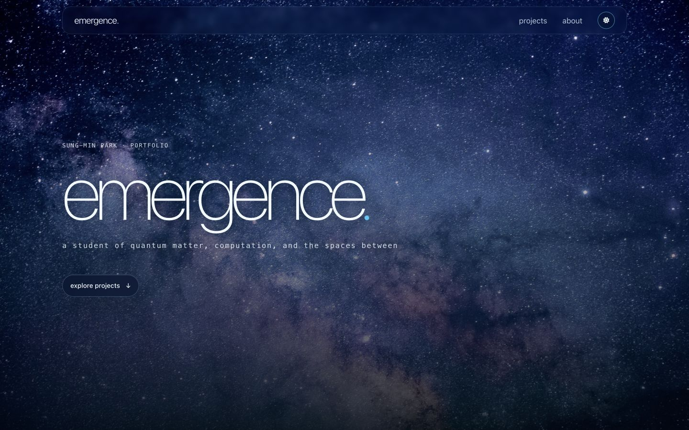
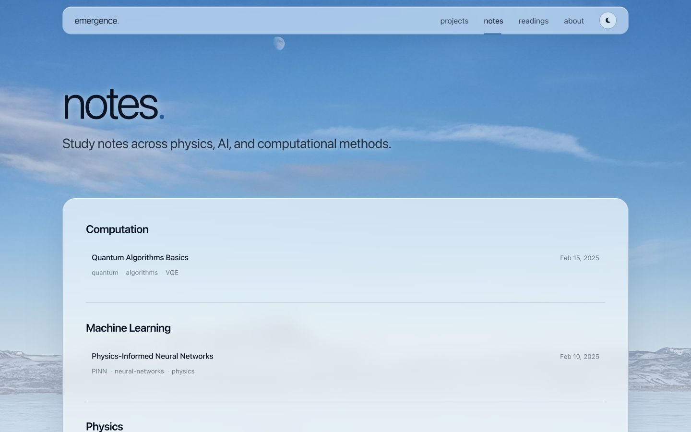
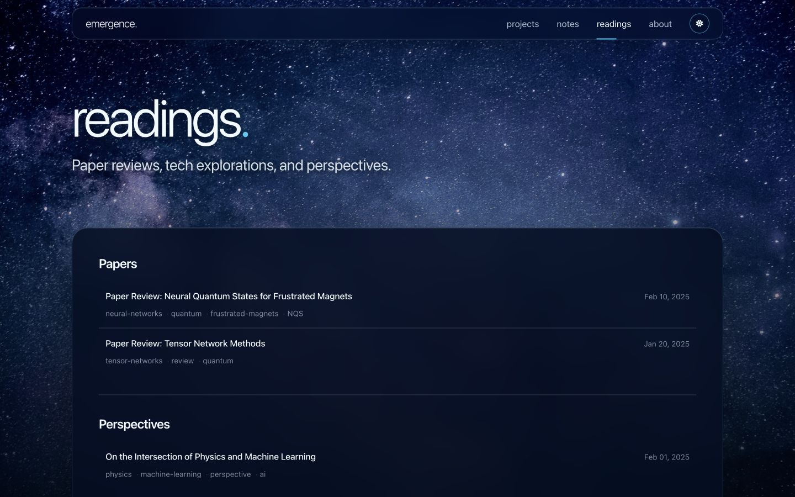
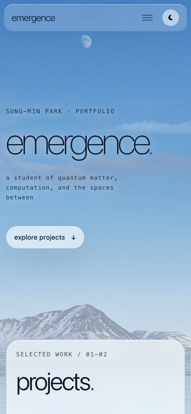
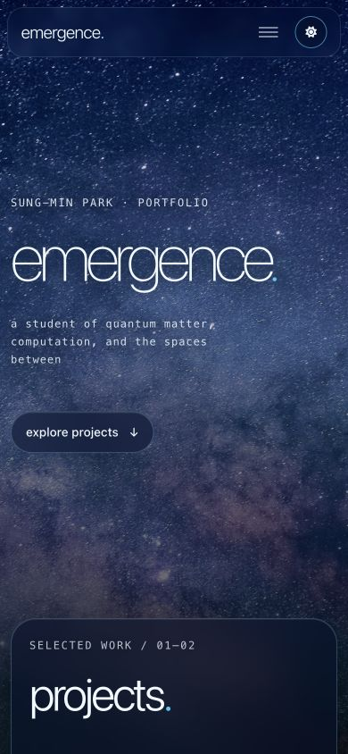

# Deep Glacier / Stellar Field 부활 — 정정된 방향

- 관련 이슈: [sungmin-park-dev.github.io #1](https://github.com/sungmin-park-dev/sungmin-park-dev.github.io/issues/1)
- 방향 확정 및 최종 검증: 2026-07-26
- 과거 기준: `orginal-emergence-deep-glacier-stellar-blue`의 `65e2120`
- 상태: 이미지 중심 디자인 시스템 구현·검증 완료. 개인 포트폴리오 기본 디자인과
  `emergence-theme` 설치형 preset으로 확정

> 정정: 이전 옵션 C는 이미지·glass·glow를 제외한 팔레트 재해석으로 정의되어
> 있었고, 사용자가 의도한 “부활”의 핵심을 놓쳤다. 그 구현과 권고는 폐기한다.

## 출발점 비교

이 비교에서 보이듯 옛 정체성의 핵심은 아이시 블루라는 색 하나가 아니었다. 사진이
첫 화면의 공간과 정보 밀도를 결정하고, `emergence.` 워드마크와 optical surface가
그 환경에 종속되는 관계 자체가 복원 대상이었다.

## 목표

옛 브랜치의 빙하·우주 이미지를 라이트/다크의 주인공으로 복원하고, 두 이미지가 가진
빛·공간·밀도에서 알맞은 디자인 시스템을 구축한다.

이는 과거 브랜치 전체로 돌아가는 작업도, 현재 flat 시스템에 색만 입히는 작업도
아니다. **과거의 이미지와 형식을 원형으로 삼되 현재 콘텐츠 계약에 맞게 다시
설계하는 image-led heritage system**이다.

## 정정된 결론

- 개인 포트폴리오에서는 Deep Glacier / Stellar Field를 기본 light/dark 정체성으로
  사용한다.
- `emergence-theme`에서는 neutral flat editorial 기본값을 유지하고, 이미지·토큰·
  Sass·홈 구성까지 포함한 완전한 설치형 `glacier-stellar` preset으로 제공한다.
- 런타임에는 기존 light/dark 토글만 둔다. 세 번째 스타일 토글은 만들지 않는다.
- 과거의 `emergence.` 워드마크, 사진 환경, glass surface, 제한된 glow를 복원한다.
- 비활성 Notes/Readings를 개인 사이트에 되살리거나 과거 Bento 메뉴 구조로
  회귀하지 않는다.

## 이미지에서 도출한 시스템

| 환경 | 이미지의 성질 | 디자인 규칙 |
|---|---|---|
| Deep Glacier | 넓은 수평선, 확산광, 차가운 공기, 낮은 대비 | 투명한 ice surface, 깊은 navy 본문, 부드러운 청색 경계, 넓고 낮은 그림자 |
| Stellar Field | 고밀도 별빛, 심우주, cyan 점광원, 강한 깊이 | indigo glass, 청백 본문, cyan edge, 의미가 있는 지점에만 제한된 glow |

공통 화면은 environment image → atmospheric veil → optical surface → content →
light signature의 다섯 레이어로 구성한다. veil은 사진을 가리는 불투명 덮개가 아니라
콘텐츠가 쌓이는 하단의 대비만 보강한다.

## 형태 문법

- **Field** — 빙하·우주 사진이 화면 환경 자체가 된다.
- **Plane** — 내비게이션, 프로젝트 인덱스, 장문 본문처럼 대비 보호가 필요한
  기능 영역에만 표면을 둔다.
- **Trace** — 빙하의 수평선에서 가져온 1–2px 선으로 현재 위치, 선택, 분리를
  표현한다.
- **Point** — 별에서 가져온 원형 신호로 테마 제어, 상태, focus처럼 하나의 의미만
  나타낸다.

상단바가 낮고 긴 `Horizon Rail`인 이유도 이 문법에서 도출된다. 전체 탐색을 담으므로
Point나 capsule이 아니라 하나의 Plane이고, 현재 위치는 하단 Trace로 표시한다. Hero
상태에서는 사진을 보존하도록 더 투명하며, 콘텐츠로 내려가면 같은 기하를 유지한 채
읽기 대비만 높인다. 원형은 Rail 전체가 아니라 독립 환경 제어인 테마 버튼에만 쓴다.

## 최종 구현 화면

### Deep Glacier

### Stellar Field

첫 화면 전체는 이미지와 `emergence.`가 지배한다. 프로젝트 목록은 첫 환경 장면
아래의 큰 Atmospheric Plane에 유지되며, About와 프로젝트 본문은 같은 환경 위의
Reading Plane으로 동작한다.

### 컬렉션과 읽기 화면

Notes와 Readings는 항목마다 glass card를 반복하지 않는다. 컬렉션 전체가 하나의
Plane이고 각 항목과 그룹은 Trace로 분리된다.

### 모바일 크롭

Glacier는 주봉과 달, Stellar는 은하수의 밀도가 남도록 환경별
`bg-position-mobile` 토큰을 별도로 사용한다.

## 보존한 계약

- `project_type`: `research`, `systems`
- `status`: `completed`, `in-progress`, `planned`
- `completed`만 링크 가능한 프로젝트 카드
- 프로젝트 탭의 키보드 조작
- 현재 About와 프로젝트 본문 콘텐츠
- 기존 light/dark preference와 토글

## 되살린 형식

- 보관 브랜치와 hash가 같은 웹 최적화 `bg-light.jpg`, `bg-dark.jpg` 파생본
- 큰 Thin `emergence.` 워드마크와 짧은 태그라인
- 반투명 optical surface와 blur
- 환경별 테두리·그림자·텍스트 대비
- Stellar의 cyan starlight와 제한된 glow
- 작은 hover 상승과 환경별 focus treatment

## 저장소별 형태

### 개인 포트폴리오

이미지 중심 시스템을 기본 디자인으로 적용한다. 홈은 heritage hero와 현재 project
index를 결합하며, About와 프로젝트 본문은 같은 환경 위의 reading surface를
사용한다.

### `emergence-theme`

neutral의 시각적 기본값은 유지한다. 공통 소스에는 `baseurl`, 접근성, 안정적인
asset 갱신 같은 템플릿 보완만 적용하고, 이미지 중심 시각 시스템은
`presets/glacier-stellar/`에 다음과 같이 격리한다.

- light/dark YAML과 portable JSON tokens
- 원본 빙하·우주 이미지
- matching SCSS fallbacks와 component/page partials
- image-led homepage
- navigation/base/post layout과 환경별 이미지 credit
- Notes/Readings의 단일 Plane + Trace index

따라서 preset은 단순 token pair가 아니라 설치 시 선택하는 완전한 디자인 시스템이다.

## 검증 기준

1. 원본 이미지의 hash가 보관 브랜치 자산과 동일한가
2. YAML 토큰과 SCSS fallback, portable JSON이 일치하는가
3. 홈·About·프로젝트 본문이 light/dark에서 읽히는가
4. 데스크톱과 모바일에서 가로 overflow가 없는가
5. 탭·메뉴·테마 토글의 키보드/접근성 계약이 유지되는가
6. `emergence-theme`의 neutral 기본값이 preset 없이 그대로 빌드되는가

## 검증 결과

- 두 배경 이미지의 hash가 보관 브랜치에 보존된 웹 파생본과 일치한다.
- 개인 사이트의 dark/light YAML과 SCSS fallback 92개 토큰이 각각 일치한다.
- `emergence-theme` preset의 YAML과 portable JSON은 환경별 92개 키·값이 모두
  일치한다.
- 개인 사이트, `emergence-theme` neutral 기본값, 설치된 preset의 Jekyll build와
  HTML Proofer가 모두 통과했다.
- 1440×900, 768px, 600px, 480px, 390×844에서 홈·Notes·Readings·About·Post를
  light/dark로 확인했고 가로 overflow가 없다.
- 390px Post는 `280px + 본문` grid에서 단일 `366px` 열로 전환된다.
- 모바일 메뉴는 동일 Horizon Rail 안에서 열리고, `aria-controls`,
  `aria-expanded`, Escape 닫기가 시각 상태와 일치한다.
- Hero → Content 스크롤에서 Rail의 기하는 유지되고 투명도·대비·활성 Trace만
  전환된다.
- 장식적 page-load fade를 제거해 사진이 즉시 렌더되고 캡처·전환 상태도
  결정적이다.
- Glacier 사진은 Sung-Min Park의 아이슬란드 직접 촬영본으로 CC BY 4.0,
  Stellar 사진은 Jeremy Thomas의 pre-2017 Unsplash CC0 작품으로 별도
  라이선스 문서와 환경별 footer에 기록했다.

승인된 릴리스 단위는 개인 포트폴리오와 `emergence-theme`의 독립 커밋이다. 전자는
Glacier/Stellar를 기본 환경으로, 후자는 neutral 기본값을 유지한 선택형 full preset으로
배포한다.
